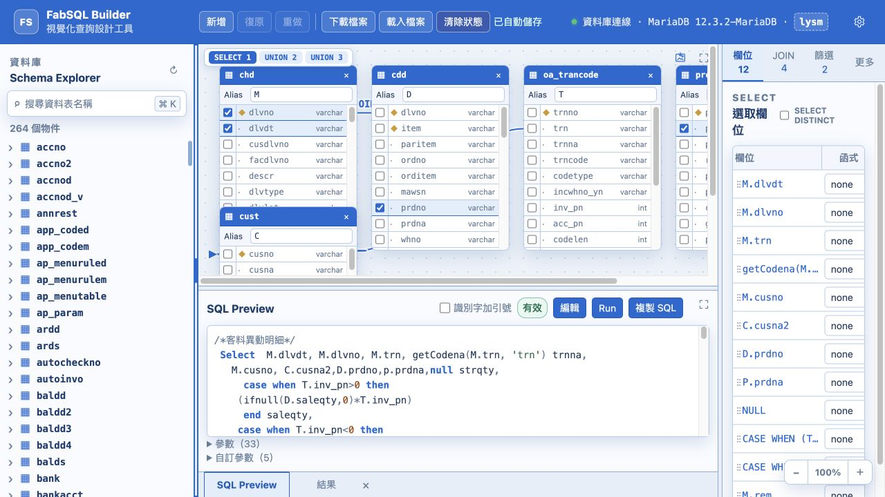

# FabSQL Builder

使用 Vue 3、TypeScript、Fastify 與 MariaDB metadata 建立的視覺化
`SELECT` Query Builder。

下圖同時顯示左側 Schema Explorer 資料表清單、中央關聯圖、
SQL Preview 與右側 Query Inspector。



目前停點：2026-07-29。最新變更與未完成事項請見
[WORKLOG.md](./WORKLOG.md)。

## 已完成範圍

- 從本機 MariaDB `lysm` 讀取 table 與 field 名稱。
- 搜尋、展開與拖曳 Schema Explorer 項目。
- 拖曳 table 到 Query Canvas，移動節點及編輯 alias。
- 使用 table field 前方 checkbox 選取或取消 Selected Fields。
- Selected Fields 可設定 alias、聚合函式與 `DISTINCT`。
- 拖曳一個 `table.field` 到另一個 `table.field` 建立 `JOIN`。
- JOIN 線直接連接兩側 field，雙擊線上文字可切換 JOIN 類型。
- JOIN 線編輯器支援 `JOIN`、`LEFT JOIN →`、`← RIGHT JOIN`，不使用外鍵或名稱推測。
- JOIN 類型保留使用者輸入的 `JOIN` 或 `INNER JOIN` 寫法，self JOIN
  以同一資料表節點的 loop 線表示。
- 建立可巢狀的 `AND`、`OR` Filters。
- 設定 `GROUP BY`、`ORDER BY`、`LIMIT`、`OFFSET`。
- 即時產生格式化 MariaDB SQL 與分離的 `?` parameters。
- SQL Preview 可切換為編輯模式；儲存成功後將 SQL 解析回 Query
  Model 並更新關聯圖，編輯期間會鎖定其他模型操作。
- SQL 反向解析支援函式、算術 expression、`CASE WHEN`、scalar
  subquery、derived table、`UNION`／`UNION ALL`、`IN (SELECT …)`、
  自訂 `@parameter` 與註解。
- 主查詢、每段 UNION 與 derived table 子查詢可由 Canvas 左上角
  導覽切換；子查詢節點可開啟明細並編輯。
- 未修改 SQL 再次儲存時會保留資料表 ID、節點位置、完整 schema
  欄位與型別，不會退回只顯示 SQL 參照欄位。
- SQL Preview 的「識別字加引號」可隨時勾選與取消；取消後會從
  原始 SQL 或編譯 SQL 移除反引號。
- 自訂參數區預設收合，支援輸入值、自動保存與重新開啟恢復；Run
  時將 named parameter 安全轉成 `?` prepared-statement parameter。
- 執行 Builder 產生的唯讀 `SELECT` 並預覽最多 200 筆結果。
- 顯示 Valid、Incomplete、Cannot compile 三種狀態。
- Undo、Redo、下載與載入 Query Model JSON 檔案。
- 自動保存 Query Model、database 與左右面板寬度，下次開啟自動恢復。
- Electron App 將操作狀態保存至系統的 App userData 目錄；瀏覽器版本
  使用 localStorage。
- `Clear State` 可清除目前執行環境保存的操作狀態。
- Schema Explorer 與 Query Inspector 可拖曳調整寬度及鍵盤操作。
- 左側 Schema Explorer、右側 Query Inspector 與下方 SQL／Result
  區都可連續縮小，接近 0 時會收合成抽屜把手；把手可反向拖曳
  展開，或單擊以預設尺寸開啟。
- Query Canvas 與下方 SQL／Result 區可在目前頁面內最大化及還原。
- Query Canvas 空白處可用滑鼠左鍵拖曳整張關聯圖。
- Query Canvas 右上角可將目前主查詢、UNION 或子查詢層級的完整
  資料表節點與 JOIN 匯出為 PNG，不受可視範圍限制。
- 頂端環境設定可測試及套用 MariaDB Socket 或 Host／Port 連線。
- API 來源可在內建 Fastify 與外部 Laravel 之間單選切換；預設仍使用
  Fastify，Laravel 預設網址為 `http://api.jl.test`。
- 環境設定可即時切換英語、繁體中文與簡體中文介面。
- 提供藍色、黑白白底、紅色與綠色四套完整工作區主題。
- 語言與主題偏好會寫入目前執行環境的持久化設定並於下次開啟恢復。

MariaDB 帳號與密碼只保留在 API，不會送到前端。Run 功能只接受
結構化 Query Model，由 API 重新驗證、編譯並以唯讀 transaction 執行。
環境設定不會回傳既有密碼，也不會將密碼寫入 localStorage；畫面套用的
連線只保留於目前 API 工作階段，重新啟動後恢復使用環境變數。

## SQL Preview 編輯

SQL Preview 的「編輯」按鈕會將目前 SQL 切換成文字編輯器，並顯示
「儲存」與「取消」。編輯期間 Schema Explorer、Query Canvas、
Query Inspector、Run、檔案操作、undo／redo 與環境切換會停用。

儲存時才會動態載入 MariaDB SQL parser，將 `SELECT` 解析成新的 Query
Model。成功後以一次 history commit 更新關聯圖；失敗時保留 SQL 草稿
與原 Query Model，使用者可繼續修改或取消。

反向解析目前涵蓋：

- 資料表、alias、Selected Fields、常用聚合函式與 `DISTINCT`。
- `JOIN`、`INNER JOIN`、`LEFT JOIN`、`RIGHT JOIN` 與額外 ON 條件。
- 巢狀 AND／OR、NULL、IN、BETWEEN 與 `IN (SELECT …)`。
- 函式、literal、算術式、比較式、`CASE WHEN` 與 scalar subquery。
- Derived table、外層欄位參照、`UNION`／`UNION ALL`。
- GROUP BY、ORDER BY、LIMIT、OFFSET 與自訂 `@parameter`。

解析成功後會把原文保存在 `sourceSql`。未進行視覺模型操作時，SQL
Preview 會保留原本的註解、空白、大小寫與排列；勾選「識別字加引號」
時顯示 compiler 產生的加引號版本，取消後恢復去除反引號的原始排列。
只要從 Canvas 或 Inspector 修改 Query Model，該層的 `sourceSql` 就會
失效並改由 compiler 產生 SQL。

仍只接受單一唯讀 SELECT 查詢集合；非 SELECT、多 statement，以及
目前 Query Model 無法完整表達的語法會阻止儲存。CTE、HAVING、Window
Function 等尚未列入已驗證範圍。

## 自訂參數與 Run

SQL 中的 `@dlvdt`、`@prdno` 等名稱會出現在 SQL Preview 下方的
「自訂參數」區。該區預設收合；展開後可輸入值。

- 輸入值會隨工作區自動保存，重新整理或重開程式後仍會恢復。
- 空白輸入會以空字串執行。
- Preview 仍顯示 `@name`，不會把實際值直接寫進 SQL。
- Run request 會送出 named parameter map；內建 Fastify API 重新編譯
  Query Model，將每個已提供的值依出現順序轉成 `?` 與 parameters。
- 自訂參數值目前屬於工作區狀態，不會寫入下載的 Query Model JSON。

## 專案結構

```text
apps/
  api/
    src/
      database/         MariaDB connection pool
      modules/query/    Read-only query executor and routes
      modules/schema/   INFORMATION_SCHEMA repository and routes
  web/
    src/
      components/       Schema Explorer, Canvas and Inspector
      preferences/      Language, translations and theme preferences
      query-builder/    UI state and drag payload
      services/         Schema API client
packages/
  shared/
    src/
      query-model.ts       Versioned Query Model
      query-validation.ts  Model and MariaDB validation
      query-compiler.ts    Query Model to SQL and parameters
      query-history.ts     Framework-independent undo/redo
```

## 本機需求

- Node.js 20 以上
- npm
- MariaDB
- 本機可讀取的 `lysm` database

## 安裝

```bash
npm install
```

## 開發

分別啟動 API 與 Web：

```bash
npm run dev:api
npm run dev:web
```

預設網址：

- Web：`http://127.0.0.1:5173`
- API：`http://127.0.0.1:3100`

## 環境變數

預設使用 `/tmp/mysql.sock` 連接本機 MariaDB，database 為 `lysm`。
需要覆寫時，參考 `.env.example`。

API 使用 `INFORMATION_SCHEMA` 讀取 metadata；只有使用者按下 Run 時，
才會以唯讀 transaction 查詢 Builder 指定的業務資料。

## 連線與驗證

環境設定提供三選一模式，側邊欄會顯示目前使用的模式：

- 資料庫連線：使用內建 Fastify API 與可編輯的 MariaDB 連線。
- API 來源：使用外部 Laravel API，以 Email／密碼取得 JWT。
- Session：使用外部 Laravel API，沿用瀏覽器內已登入的 ERP session。

任一時刻只會呼叫選中模式對應的 API。Session 模式不提供 ERP 登入
方法；使用者必須先登入 ERP，FabSQL request 會使用
`credentials: include` 帶入既有 session cookie。

網址可使用 `session` 參數直接切換至 Session 模式並設定 API：

```text
https://oa2.jeng-li.com.tw/fabsql/?session=api.jent-li.com.tw/fabsql
```

當參數未包含協定時，會自動沿用目前頁面的 `https:`，以上範例會將
API URL 設為 `https://api.jent-li.com.tw/fabsql`。

FabSQL Builder 的 API 來源與 Session 模式都可連接既有 Laravel API。
API 來源模式會保留 `/api` 路徑；Session 模式會移除 `/api` 前綴。
例如 Session 網址設定為 `http://api.jl.test/fabsql` 時，前端會呼叫：

- `GET http://api.jl.test/fabsql/health`
- `GET http://api.jl.test/fabsql/schema/databases`
- `GET http://api.jl.test/fabsql/schema/tables`
- `GET http://api.jl.test/fabsql/schema/tables/{tableName}/columns`
- `POST http://api.jl.test/fabsql/query/run`

目前對應的 Laravel 8 API 位於 `/Users/jimmywon/Herd/api.jl`，固定使用
該專案的 `jl` connection，提供：

- `GET /api/health`
- `GET /api/schema/databases`
- `GET /api/schema/tables`
- `GET /api/schema/tables/{tableName}/columns`
- `POST /api/query/run`

Laravel 端只接受結構化 Query Model，會重新驗證資料表與欄位、編譯
參數化 SQL，並在唯讀 transaction 中執行。Fastify 原有 API 與資料庫
連線設定仍完整保留。

`GET /api/health` 保持公開；databases、tables、columns 與 query API
皆需要 Laravel JWT。選擇 Laravel API 時，請在環境設定輸入既有
`api_users` 帳號。Access token 只保存在目前頁面的 `sessionStorage`，
所有受保護的 request 都會帶 `Authorization: Bearer <token>`；token
失效時最多 refresh 並重送一次，refresh 失敗則要求重新登入。

Laravel 不提供公開註冊。首次使用前，請在 Laravel 專案以互動方式建立
專用帳號，密碼只會由隱藏輸入讀取，不會出現在 shell history：

```bash
cd /Users/jimmywon/Herd/api.jl
'/Users/jimmywon/Library/Application Support/Herd/bin/php74' \
  artisan fabsql:create-user you@example.com --name="Your Name"
```

## 驗證

```bash
npm run typecheck
npm test
npm run build
```

## Build 與啟動

完整 build 會把 Shared、Web 與 API 的成果收集到同一個 `dist` 目錄：

```text
dist/
  api/          Fastify API
  node_modules/ Production runtime dependencies
  shared/       Query Model、compiler 與 validation
  web/          Vue 前端靜態檔案
  .env.example
  package.json
  start.mjs
```

從專案根目錄啟動 build 成果：

```bash
npm run build
npm start
```

預設開啟 `http://127.0.0.1:3100`。同一個 Fastify process 會提供前端
靜態檔案與 `/api`，不需要另外啟動 Vite Preview。

需要調整資料庫或監聽位置時，可先設定環境變數再啟動；變數內容參考
`.env.example`。

`npm run build` 已將 Fastify、MariaDB driver 與所需的 production
dependencies 安裝到 `dist/node_modules`。把完整的 `dist` 複製到另一個
環境後，不需再次執行 `npm install`，直接啟動即可：

```bash
cd dist
npm start
```

目標環境仍需安裝 Node.js 20 以上，並且能連線到 MariaDB。`dist` 內的
dependencies 由 build 主機產生；若 dependency 未來加入原生模組，
build 主機與目標環境需使用相容的作業系統與 CPU 架構。

## Electron 桌面版

Electron 桌面版會把 Chromium、Node.js、Fastify、MariaDB driver 與
前端資源包在應用程式內。Electron 主程序使用隨機的本機 port 啟動
Fastify，因此不會與既有的 `3100` port 衝突。

本機啟動 Electron：

```bash
npm run electron:start
```

建立目前平台的應用程式：

```bash
npm run electron:package
```

建立 macOS DMG 與 ZIP：

```bash
npm run electron:make
```

建立 Windows x64 可攜式 ZIP：

```bash
npm run electron:make:windows-x64
```

建立 Windows ARM64 原生可攜式 ZIP：

```bash
npm run electron:make:windows-arm64
```

輸出位於 `out/`。macOS 與 Windows 的成品會分開保存，不會互相覆蓋。
目前成品未使用正式憑證簽署；正式提供下載前，macOS 需設定 Apple Code
Signing 與 Notarization，Windows 則需設定 Code Signing。

## Git 忽略規則

`node_modules/` 與 `out/` 都是本機產物，已列在根目錄 `.gitignore`，
不得加入 commit 或推送到 GitHub。`dist/`、coverage、`.env` 與 log
檔案也同樣不追蹤。提交前可檢查：

```bash
git check-ignore node_modules out
git status --ignored -s
```
